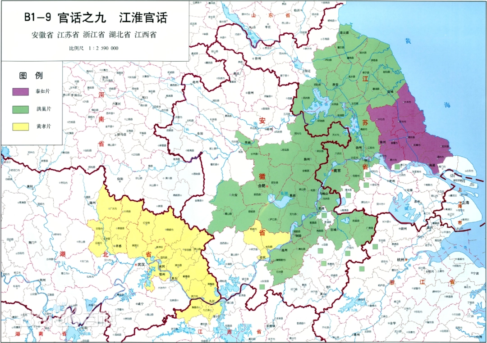

# 淮音（HuaiVoice）HuaiVoice: Jianghuai Mandarin Speech Dataset
## 江淮官话语音数据集

## 🚧 项目状态

> **本项目目前处于数据采集与建设阶段，数据集尚未正式发布。**
>
> 后续将持续收集江淮官话语音样本，完善语音标注、数据清洗以及基准模型测试，并逐步开放数据资源。

---

## 📖 项目简介
**淮音（HuaiVoice）** 是一个面向江淮官话自动语音识别（Automatic Speech Recognition, ASR）任务构建的区域性语音数据集。

该数据集旨在收集和整理真实场景下的江淮官话语音资源，覆盖不同说话人、语音环境以及发音特点，为方言语音识别、语音理解、语音模型训练以及区域语言资源保护提供数据支持。

本项目希望通过人工智能技术推动江淮官话语音资源数字化，为深度学习语音模型研究和智能语音应用提供基础数据。

---
---

## 🌏 江淮官话简介

**江淮官话（Jianghuai Mandarin）** 是汉语官话的重要分支之一，主要分布于长江与淮河流域之间，覆盖安徽、江苏等地区，并延伸至浙江、江西、湖北等部分区域。

江淮官话在历史演变过程中受到吴语、赣语等周边方言影响，形成了独特的语音、词汇和语法特点。与北方官话相比，江淮官话保留了部分古汉语语音特征，例如部分地区保留入声调类，同时不同片区之间存在较明显的语音差异。

根据《中国语言地图集》的划分，江淮官话主要包括：

- **洪巢片**
- **泰如片**
- **黄孝片**

其中，泰如片主要分布于江苏中部地区，包括泰州、如皋、海安、靖江等地，是江淮官话的重要组成部分之一。

由于区域差异、人口流动以及普通话普及等因素影响，部分江淮官话语音资源正在逐渐减少，缺少规模化、标准化的公开语音数据集。因此，构建面向江淮官话的语音数据资源，对于方言保护、智能语音技术研究以及区域语言数字化具有重要意义。

---

## 🗣️ 数据采集计划

**淮音（HuaiVoice）项目将采用分阶段方式建设江淮官话语音数据集。**

第一阶段计划优先开展：

### 泰如片（Tai-Ru Subgroup）语音采集

重点采集区域包括：

- 江苏泰州
- 江苏如皋
- 江苏海安
- 江苏靖江

采集内容包括：

- 日常交流语音
- 朗读语音
- 方言词汇
- 自然对话场景

后续将在泰如片数据建设完成基础上，逐步扩展至：

- 洪巢片
- 黄孝片

最终形成覆盖主要江淮官话区域的语音数据资源库。

---

## ✨ 数据集特点

- ✅ 面向江淮官话语音识别任务
- ✅ 包含真实语音采集场景
- ✅ 支持自动语音识别（ASR）模型训练
- ✅ 支持方言识别与语音分析研究
- ✅ 为区域语言资源保护提供数据支持

---

## 📊 数据集信息

| 项目 | 内容 |
| ---- | ---- |
| 数据集名称 | 淮音（HuaiVoice） |
| 语言类型 | 江淮官话 |
| 任务类型 | 自动语音识别（ASR） |
| 数据格式 | WAV + 标注文本 |
| 标注内容 | 音频文件、文本转录、说话人信息 |
| 应用方向 | ASR、方言识别、语音理解 |

---

## 📂 数据集结构

---

## 🚀 应用场景

### 1. 自动语音识别（ASR）

用于训练端到端语音识别模型：

- Conformer
- Whisper
- Wav2Vec2
- Paraformer

### 2. 方言识别

用于研究：

- 江淮官话分类
- 区域语言差异分析
- 多方言识别

### 3. 语音智能应用

支持：

- 智能语音助手
- 方言交互系统
- 地方文化数字化保护

---

## 🧠 基准模型

计划提供以下模型测试：

## 📌 数据获取

数据集将在后续完善后开放下载。

如需使用数据集进行科研研究，请注明：
HuaiVoice: Jianghuai Mandarin Speech Dataset
---

## 📚 Citation

如果本数据集用于论文研究，请引用：暂无论文发表
